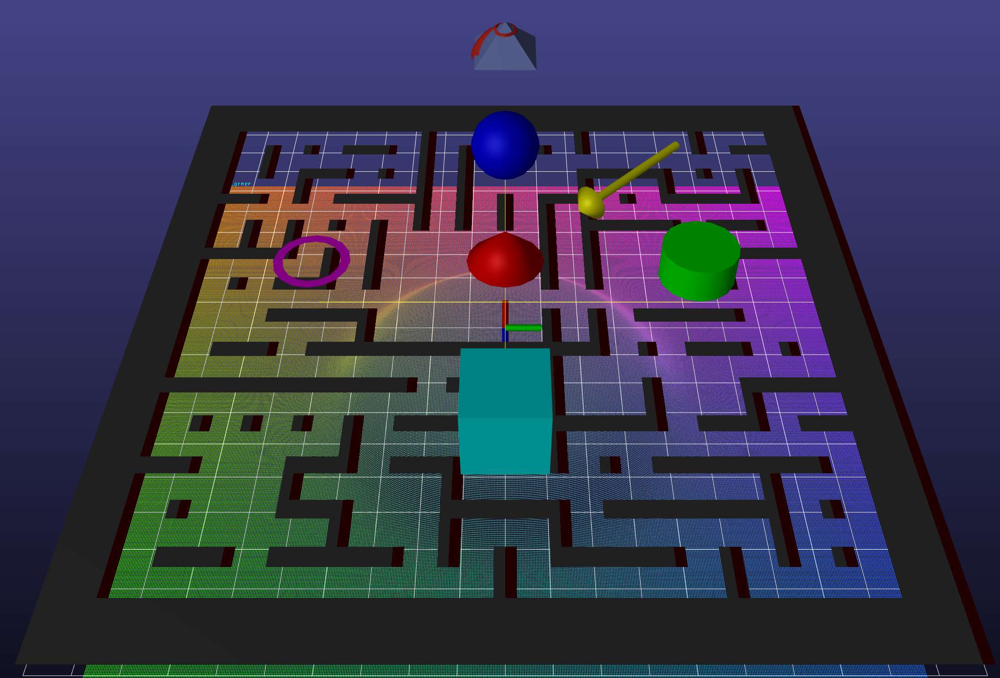

# vephor

## A header-only headless visualization library with an OpenGL backend

<div align="center">
  
</div>

## Summary

Vephor allows for interactive visualizations in situations where visualizations are infeasible, such as on headless systems, or where it is inconvenient to include graphics libraries.  

Vephor creates graphics library agnostic visualization definitions before either saving them to disk for later viewing or sending them to a visualizer elsewhere for immediate viewing.  

When running in server mode, Vephor visualization code is meant to be as dormant as possible, only using resources when a client connects and requests the visualization.

Vephor supports both C++ and Python.

## Dependencies

Vephor requires the following dependencies

| Dependency \[version]                               | Core               | OpenGL             |
|-----------------------------------------------------|--------------------|--------------------|
| [Eigen](https://eigen.tuxfamily.org/) \[≥ 3.3.0]    | :heavy_check_mark: | :heavy_check_mark: |
| [manif](https://artivis.github.io/manif/index.html) | :heavy_check_mark: | :heavy_check_mark: |
| [GLEW](https://glew.sourceforge.net/)               | :x:                | :heavy_check_mark: |
| [GLFW](https://www.glfw.org/)                       | :x:                | :heavy_check_mark: |

See core/README.md and opengl/README.md for more details on separated dependencies.

### vcpkg

All required dependencies can be installed via vcpkg if you opt to build the software with their toolchain.

This requires that you have vcpkg installed on your system. If not yet installed, you may install as follows. See
the [official documentation](https://learn.microsoft.com/en-us/vcpkg/get_started/get-started?pivots=shell-bash) for
additional details and instructions for Windows systems. Install vcpkg in a persistent directory on your system.

```bash
cd <persistent-directory>

# Download and bootstrap vcpkg
git clone https://github.com/microsoft/vcpkg.git
cd vcpkg
./bootstrap-vcpkg.sh

# Set VCPKG_ROOT and prepend it to your path
vcpkg_root=$(pwd)
echo "export VCPKG_ROOT=$vcpkg_root" >> ~/.bashrc
echo "export PATH=\${VCPKG_ROOT}\${PATH:+:\${PATH}}" >> ~/.bashrc
```

### Linux

Refer to the following instructions to manually install dependencies on an Ubuntu system. Feel free to adapt to your
distro and package manager of choice.

#### Eigen

```bash
sudo apt install libeigen3-dev
```

#### manif

Note that manif depends on Eigen. If Eigen is installed in a non-standard location, be sure to provide a
`CMAKE_PREFIX_PATH` when configuring.

```bash
git clone https://github.com/artivis/manif.git
cd manif
cmake -S . -B build
cmake --build build
sudo cmake --install build
```

#### GLEW

```bash
sudo apt install libglew-dev
```

#### GLFW

```bash
sudo apt install libglfw3-dev
```

## C++ Install

Below are supported methods for building and installing the Vephor C++ library.

### vcpkg

Build and install as described in the following sections but with the additional CMake configuration flag
`-DCMAKE_TOOLCHAIN_FILE=$VCPKG_ROOT/scripts/buildsystems/vcpkg.cmake`. Alternately, for Linux systems, build with the
`--preset=vcpkg` flag. See the following example configure steps.

```bash
cmake -S . -B build -DCMAKE_TOOLCHAIN_FILE=$VCPKG_ROOT/scripts/buildsystems/vcpkg.cmake ...
cmake -S . -B build --preset=vcpkg ...  # Linux only
```

### Linux

```bash
cd <vephor-root>

cmake -S . -B build -DCMAKE_BUILD_TYPE=Release
cmake --build build
sudo cmake --install build
```

### Windows

```bash
cd <vephor-root>

cmake -S . -B build -DCMAKE_BUILD_TYPE=Release -DCMAKE_INSTALL_PREFIX=c:/msys64/mingw64
cd build
mingw32-make
sudo mingw32-make install
```

## Python Install

Install the Vephor library Python bindings in the active Python environment as follows.

### Linux

```bash
pip install .
```

### Windows

```bash
pip install . --config-settings=cmake.generator="MinGW Makefiles"
```

### Troubleshooting

Refer to the contained sections for common Python installation issues.

#### Conda Environment

Conda employs
their [own set of compiler tools](https://docs.conda.io/projects/conda-build/en/stable/resources/compiler-tools.html#)
over those installed on the system. There is a known compatability bug between these tools and modern versions of the
GCC compiler (see ContinuumIO/anaconda-issues#11152). If you encounter linker errors when installing (e.g. those shown
below), then attempt one of the solutions
described [here](https://github.com/ContinuumIO/anaconda-issues/issues/11152#issuecomment-1453005442).

<details>
<summary>Example linker error</summary>

```
/home/username/conda/envs/my_env/compiler_compat/ld: warning: libGLdispatch.so.0, needed by /usr/lib/gcc/x86_64-linux-gnu/11/../../../x86_64-linux-gnu/libGL.so, not found (try using -rpath or -rpath-link)
/home/username/conda/envs/my_env/compiler_compat/ld: warning: libGLX.so.0, needed by /usr/lib/gcc/x86_64-linux-gnu/11/../../../x86_64-linux-gnu/libGL.so, not found (try using -rpath or -rpath-link)
/home/username/conda/envs/my_env/compiler_compat/ld: warning: libxcb.so.1, needed by /usr/lib/gcc/x86_64-linux-gnu/11/../../../x86_64-linux-gnu/libX11.so, not found (try using -rpath or -rpath-link)
/home/username/conda/envs/my_env/compiler_compat/ld: /usr/lib/gcc/x86_64-linux-gnu/11/../../../x86_64-linux-gnu/libX11.so: undefined reference to `xcb_get_maximum_request_length'
/home/username/conda/envs/my_env/compiler_compat/ld: /usr/lib/gcc/x86_64-linux-gnu/11/../../../x86_64-linux-gnu/libGL.so: undefined reference to `__glDispatchRegisterStubCallbacks'
/home/username/conda/envs/my_env/compiler_compat/ld: /usr/lib/gcc/x86_64-linux-gnu/11/../../../x86_64-linux-gnu/libGL.so: undefined reference to `__glXGLLoadGLXFunction'
/home/username/conda/envs/my_env/compiler_compat/ld: /usr/lib/gcc/x86_64-linux-gnu/11/../../../x86_64-linux-gnu/libX11.so: undefined reference to `xcb_poll_for_queued_event'
/home/username/conda/envs/my_env/compiler_compat/ld: /usr/lib/gcc/x86_64-linux-gnu/11/../../../x86_64-linux-gnu/libX11.so: undefined reference to `xcb_wait_for_event'
/home/username/conda/envs/my_env/compiler_compat/ld: /usr/lib/gcc/x86_64-linux-gnu/11/../../../x86_64-linux-gnu/libX11.so: undefined reference to `xcb_get_setup'
/home/username/conda/envs/my_env/compiler_compat/ld: /usr/lib/gcc/x86_64-linux-gnu/11/../../../x86_64-linux-gnu/libX11.so: undefined reference to `xcb_poll_for_event'
/home/username/conda/envs/my_env/compiler_compat/ld: /usr/lib/gcc/x86_64-linux-gnu/11/../../../x86_64-linux-gnu/libX11.so: undefined reference to `xcb_connection_has_error'
/home/username/conda/envs/my_env/compiler_compat/ld: /usr/lib/gcc/x86_64-linux-gnu/11/../../../x86_64-linux-gnu/libGL.so: undefined reference to `__glDispatchFini'
/home/username/conda/envs/my_env/compiler_compat/ld: /usr/lib/gcc/x86_64-linux-gnu/11/../../../x86_64-linux-gnu/libX11.so: undefined reference to `xcb_take_socket'
/home/username/conda/envs/my_env/compiler_compat/ld: /usr/lib/gcc/x86_64-linux-gnu/11/../../../x86_64-linux-gnu/libX11.so: undefined reference to `xcb_disconnect'
/home/username/conda/envs/my_env/compiler_compat/ld: /usr/lib/gcc/x86_64-linux-gnu/11/../../../x86_64-linux-gnu/libX11.so: undefined reference to `xcb_generate_id'
/home/username/conda/envs/my_env/compiler_compat/ld: /usr/lib/gcc/x86_64-linux-gnu/11/../../../x86_64-linux-gnu/libGL.so: undefined reference to `__glDispatchUnregisterStubCallbacks'
/home/username/conda/envs/my_env/compiler_compat/ld: /usr/lib/gcc/x86_64-linux-gnu/11/../../../x86_64-linux-gnu/libGL.so: undefined reference to `__GLXGL_CORE_FUNCTIONS'
/home/username/conda/envs/my_env/compiler_compat/ld: /usr/lib/gcc/x86_64-linux-gnu/11/../../../x86_64-linux-gnu/libGL.so: undefined reference to `_glapi_tls_Current'
/home/username/conda/envs/my_env/compiler_compat/ld: /usr/lib/gcc/x86_64-linux-gnu/11/../../../x86_64-linux-gnu/libX11.so: undefined reference to `xcb_parse_display'
/home/username/conda/envs/my_env/compiler_compat/ld: /usr/lib/gcc/x86_64-linux-gnu/11/../../../x86_64-linux-gnu/libGL.so: undefined reference to `__glDispatchInit'
/home/username/conda/envs/my_env/compiler_compat/ld: /usr/lib/gcc/x86_64-linux-gnu/11/../../../x86_64-linux-gnu/libX11.so: undefined reference to `xcb_wait_for_reply64'
/home/username/conda/envs/my_env/compiler_compat/ld: /usr/lib/gcc/x86_64-linux-gnu/11/../../../x86_64-linux-gnu/libX11.so: undefined reference to `xcb_poll_for_reply64'
/home/username/conda/envs/my_env/compiler_compat/ld: /usr/lib/gcc/x86_64-linux-gnu/11/../../../x86_64-linux-gnu/libX11.so: undefined reference to `xcb_connect'
/home/username/conda/envs/my_env/compiler_compat/ld: /usr/lib/gcc/x86_64-linux-gnu/11/../../../x86_64-linux-gnu/libX11.so: undefined reference to `xcb_writev'
/home/username/conda/envs/my_env/compiler_compat/ld: /usr/lib/gcc/x86_64-linux-gnu/11/../../../x86_64-linux-gnu/libX11.so: undefined reference to `xcb_connect_to_display_with_auth_info'
/home/username/conda/envs/my_env/compiler_compat/ld: /usr/lib/gcc/x86_64-linux-gnu/11/../../../x86_64-linux-gnu/libX11.so: undefined reference to `xcb_get_file_descriptor'
collect2: error: ld returned 1 exit status
```

</details>

## API - TLDR

The `Window` class is the primary way to interact with the library.  Objects that implement certain render functions can be added to the `Window`, yielding a `RenderNode` that can be used to control the object's pose, scale, visibility, and which allows object destruction.

```
w = Window()
s = Sphere()
node = w.add(s)
node.setScale(2.0)
w.render()
```

For 2d plotting, the `Plot` class is the recommended way to interact with the library.  This presents an interface similar to matplotlib, though the underlying `Window` can also be accessed.

```
p = Plot()
p.plot([0,10],[0,10])
p.scatter([0,10],[10,0])
p.show()
```

The list of supported objects and function calls can be found farther down.

## Examples

Note that the following examples alternate between C++ and Python, but all features are available in both.

### Viz by process creation

This is the default mode for viewing Vephor visualizations - your visualization will be written to a temporary location on disk, and a vephor_show process will be created and pointed to that location.  Note that these visualizations are not interactive apart from allowing camera movement - only network based visualizations allow the creator to respond to callbacks.

```
#include "vephor_ext.h"

using namespace vephor;

int main()
{
	Window window;
	
	window.add(make_shared<Axes>(), Vec3(500,-1000,2000));
	window.add(make_shared<Sphere>(), Vec3(495,-1000,2000));
	window.add(make_shared<Cone>(), Vec3(505,-1000,2000));
	window.add(make_shared<Cylinder>(), Vec3(500,-995,2000));
	window.add(make_shared<Cube>(), Vec3(500,-1005,2000));
	
	window.render();

	return 0;
}
```

### Viz by saving to a file

```
#! /usr/bin/env python3

import vephor as v4
import numpy as np

w = v4.Window()

points = []
for i in range(0,100):
    for j in range(0,100):
        points.append((i,j,0))
points = np.array(points)

p = v4.Particle(points)
p.setScreenSpaceMode()
p.setSize(0.001)
w.add(p)
w.save("test_scene")
```

This will create a folder called test_scene.  The visualization can then be viewed by calling:

```
vephor_show test_scene
```

### Viz by server

The following code will open a server on the default Vephor port, 5533.  The port can be set when enabling server mode.

In addition to server use, this example also shows how to allow the client to continue updating the visualization.  The visualization will run separately from any client being connected, and a new client will begin visualizing at the current state of the client.

Note that multiple clients can connect to one server.

```
#include "vephor_ext.h"

using namespace vephor;

int main()
{
	Window window;
	
	window.setServerMode();
	
	double obj_mesh_dist = 5.0f;
	
	
	// Make a "clock"
	for (int i = 1; i <= 12; i++)
	{
		float angle = i / 12.0 * 2 * M_PI;
		
		Vec3 dir = Vec3(cos(angle), sin(angle), 0);
		auto text = make_shared<Text>(std::to_string(i));
		text->setAnchorCentered();
		window.add(text, dir * obj_mesh_dist * 1.5);
		
		vector<Vec3> verts = {
			Vec3(0,0,0),
			dir * obj_mesh_dist * 1.5
		};
		window.add(make_shared<Lines>(verts), Vec3::Zero());
	}
	
	// Use a mesh for the clock hand
	string base_asset_dir = getBaseAssetDir();
	auto obj_mesh = make_shared<ObjMesh>(base_asset_dir+"/assets/pyramid.obj");
	auto obj_mesh_node = window.add(obj_mesh, Transform3(Vec3(obj_mesh_dist,0,0)));
	
	float angle = 0;
	while (true)
	{
		angle += 0.01;
		obj_mesh_node->setPos(Vec3(cos(angle), sin(angle), 0) * obj_mesh_dist);
		obj_mesh_node->setOrient(Vec3(0,0,angle+M_PI));
		
		window.render(false /*wait*/);
		
		std::this_thread::sleep_for(std::chrono::milliseconds((int)(33)));
	}

	return 0;
}
```

Once this server is running, connect to it using:

```
vephor_show -m client
```

### Viz by server (bring your own client)

"Bring your own client" mode allows you to create interactive visualizations without needing to separately call vephor_show.  It will create a server and also create a client process to talk to that server.

TODO

### Transform tree

TODO

### 2d plotting

TODO

### Image plotting

```
#! /usr/bin/env python3

import os

import vephor as v4
import numpy as np

image = np.zeros((16,16,3))
image[:8,8:] = np.array((0.5,0.5,0.5))
image[8:,:8] = np.array((0.75,0.75,0.75))
image[8:,8:] = np.array((1,1,1))

plt = v4.Plot()
plt.imshow(image)
plt.show()
```

### Image plotting - OpenCV images in C++

TODO

## API - Exhaustive

Here are, as compactly as possible, all the relevant functions this library provides.  This is meant to give an overview - see source for explicit data types.

<table>
	<tr><th>Window</th><td>Window</td><td>Create a window.  Width/height of (-1,-1) means the window should fill the screen.</td><td>(width=-1, height=-1, title="show")</td></tr>
	<tr><td></td><td>add</td><td>Add an object to the window for rendering.</td><td>(obj, transform=identity, overlay=false, layer=0)</td></tr>
	<tr><td></td><td>canRender</td><td>Check if rendering is possible, for example when a client is connected in server mode.</td></tr>
	<tr><td></td><td>render</td><td>Render current window contents.</td><td>(wait_close=true, wait_key=false)</td></tr>
	<tr><td></td><td>save</td><td>Save current window contents to a file.</td><td>(path)</td></tr>
	<tr><td></td><td>clear</td><td>Remove all current window contents.</td></tr>
	<tr><td></td><td>setTitle</td><td>Set window title.</td><td>(title)</td></tr>
	<tr><td></td><td>setTrackballMode</td><td>Set up the standard 3d camera mode.</td><td>(to=(0,0,0), from=(-1,0,-1), up=(0,0,-1), use_3d=false)</td></tr>
	<tr><td></td><td>setPlotMode</td><td>Set up the 2d plotting camera mode.</td><td>equal=false</td></tr>
	<tr><td></td><td>setServerMode</td><td>Put the window in server mode.</td><td>(wait=false, port=5533, record_also=false, record_path="", metadata=default)</td></tr>
	<tr><td></td><td>setServerModeBYOC</td><td>Put the window in server mode, and spawns a client to connect.</td><td>(record_also=false,record_path="")</td></tr>
	<tr><td></td><td>setRecordMode</td><td>Put the window in record mode.</td><td>(path="")</td></tr>
	<tr><td></td><td>checkAndConsumeFlag</td><td>Check a server metadata flag, and consume it if it is a one-shot flag.</td><td>(flag)</td></tr>
	<tr><td></td><td>setKeyPressCallback</td><td>Set key press callback function.</td><td>(callback)</td></tr>
	<tr><th>RenderNode</th></tr>
	<tr><td></td><td>getPos</td><td>Get position of node in parent frame.</td></tr>
	<tr><td></td><td>setPos</td><td>Set position of node in parent frame.</td><td>(pos_in_world)</td></tr>
	<tr><td></td><td>getOrient</td><td>Get rotation that rotates node frame to parent frame.</td></tr>
	<tr><td></td><td>setOrient</td><td>Set rotation that rotates node frame to parent frame.</td><td>(parent_from_node_rotation)</td></tr>
	<tr><td></td><td>getTransform</td><td>Get transform that transforms node frame to parent frame.</td></tr>
	<tr><td></td><td>setTransform</td><td>Set transform that transforms node frame to parent frame.</td><td>(parent_from_node)</td></tr>
	<tr><td></td><td>getScale</td><td>Get scale of the node.</td></tr>
	<tr><td></td><td>setScale</td><td>Set scale of the node.</td><td>(scale)</td></tr>
	<tr><td></td><td>setParent</td><td>Set the transform parent of this node.  Replaces world frame as parent.</td><td>(parent)</td></tr>
	<tr><td></td><td>getShow</td><td>Get whether node should be shown.</td></tr>
	<tr><td></td><td>setShow</td><td>Set whether node should be shown.</td><td>(show)</td></tr>
	<tr><td></td><td>getDestroy</td><td>Get whether node has been destroyed.</td></tr>
	<tr><td></td><td>setDestroy</td><td>Set node to be destroyed.</td></tr>
	<tr><th>Plot</th><td>Plot</td><td>Create a plot.</td><td>(title)</td></tr>
	<tr><td></td><td>plot</td><td>Plot a continuous line.</td><td>(x_list, y_list, options)</td></tr>
	<tr><td></td><td>scatter</td><td>Plot a set of points.</td><td>(x_list, y_list, options)</td></tr>
	<tr><td></td><td>show</td><td>Render current plot contents.</td><td>(wait_close=true, wait_key=false)</td></tr>
	<tr><td></td><td>save</td><td>Save current window contents to a file.</td><td>(path)</td></tr>
	<tr><td></td><td>clear</td><td>Remove all current plot contents.</td></tr>
	<tr><td></td><td>title</td><td>Set plot title.</td><td>(title)</td></tr>
	<tr><td></td><td>xlabel</td><td>Set x axis label.</td><td>(label)</td></tr>
	<tr><td></td><td>ylabel</td><td>Set y axis label.</td><td>(label)</td></tr>
	<tr><td></td><td>equal</td><td>Set plot axes to have equal scales.</td><td>(is_equal)</td></tr>
	<tr><td></td><td>limits</td><td>Set plot limits.</td><td>(min_x, max_x, min_y, max_y)</td></tr>
	<tr><td></td><td>text</td><td>Add text to the plot.</td><td>(text, height, pos, color)</td></tr>
	<tr><td></td><td>polygon</td><td>Add a polygon to the plot. 0 thickness for a thin line border, -1 for filled.</td><td>(verts, color, thickness=0)</td></tr>
	<tr><td></td><td>circle</td><td>Add a circle to the plot. 0 thickness for a thin line border, -1 for filled.</td><td>(center, rad, color, thickness=0, slices=16)</td></tr>
	<tr><td></td><td>rect</td><td>Add a rectangle to the plot. 0 thickness for a thin line border, -1 for filled.</td><td>(center, width, height, color, thickness=0</td></tr>
	<tr><td></td><td>line</td><td>Add a line to the plot.</td><td>(vert_list, color, thickness)</td></tr>
	<tr><td></td><td>imshow</td><td>Add an image to the plot.</td><td>(image, nearest_filtering=false, pos=(0,0))</td></tr>
	<tr><th>Arrow</th><td>Arrow</td><td>Create an arrow.</td><td>(start, end, rad=1.0, slices=16)</td></tr>
	<tr><td></td><td>setColor</td><td>Set color.</td><td>(color)</td></tr>
	<tr><th>Axes</th><td>Axes</td><td>Create a set of axes.</td><td>(size=1.0)</td></tr>
	<tr><th>Circle</th><td>Circle</td><td>Create a circular disc with a z axis normal.  Outer rim of the disc is set by rad, inner rim is thickness units inwards.</td><td>(rad=1.0, thickness=1.0, slices=16)</td></tr>
	<tr><td></td><td>setColor</td><td>Set color.</td><td>(color)</td></tr>
	<tr><th>Cone</th><td>Cone</td><td>Create a cone with the flat surface in the z=0 plane, with the top height units along the z axis.</td><td>(rad=1.0, height=1.0, slices=16)</td></tr>
	<tr><td></td><td>setColor</td><td>Set color.</td><td>(color)</td></tr>
	<tr><th>Cube</th><td>Cube</td><td>Create a cube.</td><td>(rad)</td></tr>
	<tr><td></td><td>setColor</td><td>Set color.</td><td>(color)</td></tr>
	<tr><th>Cylinder</th><td>Cylinder</td><td>Create a cylinder along the z axis, with half of height on either side.</td><td>(rad=1.0, height=1.0, slices=16)</td></tr>
	<tr><td></td><td>setColor</td><td>Set color.</td><td>(color)</td></tr>
	<tr><th>Grid</th><td>Grid</td><td>Create a grid.</td><td>(rad, normal=(0,0,1), right=(1,0,0), cell_size=1.0)</td></tr>
	<tr><td></td><td>setColor</td><td>Set color.</td><td>(color)</td></tr>
	<tr><th>Lines</th><td>Lines</td><td>Create a line.</td><td>(vert_list, color_list)</td></tr>
	<tr><td></td><td>setColor</td><td>Set color.</td><td>(color)</td></tr>
	<tr><td></td><td>setLineStrip</td><td>Set if verts form a continuous line - if false, each pair is a separate line.  Initial state is a continuous line.</td><td>(is_strip)</td></tr>
	<tr><th>Mesh</th><td>Mesh</td><td>Create a mesh.</td><td>(mesh_data)</td></tr>
	<tr><td></td><td>setTexture</td><td>Set texture for this mesh.</td><td>(image, nearest_filtering=false)</td></tr>
	<tr><td></td><td>setColor</td><td>Set color.</td><td>(color)</td></tr>
	<tr><td></td><td>setSpecular</td><td>Set whether specular highlights should be used.</td><td>(specular)</td></tr>
	<tr><td></td><td>setCull</td><td>Set whether faces should be culled if facing away from the camera.</td><td>(cull)</td></tr>
	<tr><th>ObjMesh</th><td>ObjMesh</td><td>Create geometry using a .obj mesh file.</td><td>(path)</td></tr>
	<tr><td></td><td>setColor</td><td>Set color.</td><td>(color)</td></tr>
	<tr><th>Particle</th><td>Particle</td><td>Create a point cloud.</td><td>(vert_list, color_list)</td></tr>
	<tr><td></td><td>setSize</td><td>Set size of each particle.</td><td>(size)</td></tr>
	<tr><td></td><td>setColor</td><td>Set color.</td><td>(color)</td></tr>
	<tr><td></td><td>setTexture</td><td>Set texture for each particle.</td><td>(image, nearest_filtering=false)</td></tr>
	<tr><td></td><td>setScreenSpaceMode</td><td>Set whether particle size is in metric space or screen space. If in screen space, size is taken as a screen space portion from 0 to 1.</td><td>(is_screen_space)</td></tr>
	<tr><th>Plane</th><td>Plane</td><td>Create a rectangular plane segment.</td><td>(rads)</td></tr>
	<tr><td></td><td>setColor</td><td>Set color.</td><td>(color)</td></tr>
	<tr><td></td><td>setTexture</td><td>Set texture for each particle.</td><td>(image, nearest_filtering=false)</td></tr>
	<tr><th>Sphere</th><td>Sphere</td><td>Create a sphere.</td><td>(rad=1.0, slices=16, stacks=16)</td></tr>
	<tr><td></td><td>setColor</td><td>Set color.</td><td>(color)</td></tr>
	<tr><th>Sprite</th><td>Sprite</td><td>Create a screen-facing rectangle bearing an image.</td><td>(image, nearest_filtering=false)</td></tr>
	<tr><td></td><td>setColor</td><td>Set color.</td><td>(color)</td></tr>
	<tr><td></td><td>setFlip</td><td>Set whether image should be flipped vertically.</td><td>(flip)</td></tr>
	<tr><td></td><td>setNormalSpriteSheet</td><td>Set normal texture for the sprite.</td><td>(image, nearest_filtering=false)</td></tr>
	<tr><th>Text</th><td>Text</td><td>Create text.  Initial zero point is at the bottom left.</td><td>(text)</td></tr>
	<tr><td></td><td>setColor</td><td>Set color.</td><td>(color)</td></tr>
	<tr><td></td><td>setAnchorBottomLeft</td><td>Set zero point of text to the bottom left.</td></tr>
	<tr><td></td><td>setAnchorLeft</td><td>Set zero point of text to the left.</td></tr>
	<tr><td></td><td>setAnchorTopLeft</td><td>Set zero point of text to the top left.</td></tr>
	<tr><td></td><td>setAnchorBottom</td><td>Set zero point of text to the bottom middle.</td></tr>
	<tr><td></td><td>setAnchorCentered</td><td>Set zero point of text to the middle.</td></tr>
	<tr><td></td><td>setAnchorTop</td><td>Set zero point of text to the top middle.</td></tr>
	<tr><td></td><td>setAnchorBottomRight</td><td>Set zero point of text to the bottom right.</td></tr>
	<tr><td></td><td>setAnchorRight</td><td>Set zero point of text to the right.</td></tr>
	<tr><td></td><td>setAnchorTopRight</td><td>Set zero point of text to the top right.</td></tr>
	<tr><th>ThickLines</th><td>ThickLines</td><td>Create a set of lines with consistent screen space thickness.</td><td>(vert_list, color_list)</td></tr>
	<tr><td></td><td>setColor</td><td>Set color.</td><td>(color)</td></tr>
	<tr><td></td><td>setLineWidth</td><td>Set line width in screen space portion.</td><td>(line_width)</td></tr>
	<tr><th>Loose functions</th><td>TODO</td></tr>
	<tr><th>MeshData</th><td>TODO</td></tr>
	<tr><td></td><td>formLine</td><td>Make mesh data for a 3d line with some thickness.</td><td>(vert_list, rad)</td></tr>
	<tr><td></td><td>formLineLoop</td><td>Make mesh data for a 3d line with some thickness.  Same as formLine, but makes the line into a loop by repeating the first vertex.</td><td>(vert_list, rad)</td></tr>
	<tr><td></td><td>formPolygon</td><td>Make mesh data for an XY plane polygon.</td><td>(vert_list)</td></tr>
	<tr><td></td><td>formCube</td><td>Make mesh data for a cube.</td></tr>
	<tr><td></td><td>formSphere</td><td>Make mesh data for a sphere.</td><td>(slices, stacks)</td></tr>
	<tr><td></td><td>formCone</td><td>Make mesh data for a cone.</td><td>(rad, height, slices, smooth=true)</td></tr>
	<tr><td></td><td>formCylinder</td><td>Make mesh data for a cylinder.</td><td>(rad, height, slices, smooth=true)</td></tr>
	<tr><td></td><td>formPlane</td><td>Make mesh data for an XY plane segment.</td><td>(rads)</td></tr>
	<tr><td></td><td>formCircle</td><td>Make mesh data for an XY plane circle.</td><td>(rad, thickness, slices)</td></tr>
	<tr><td></td><td>formHeightMap</td><td>Make mesh data for a height map.</td><td>(height, res, uv_callback=none)</td></tr>
	<tr><th>Image</th><td>TODO</td></tr>
	<tr><td></td><td>generateSimpleImage
	<tr><td></td><td>generateGradientImage
	<tr><td></td><td>generateCheckerboardImage
	<tr><td></td><td>loadImage
	<tr><td></td><td>saveImage
</table>