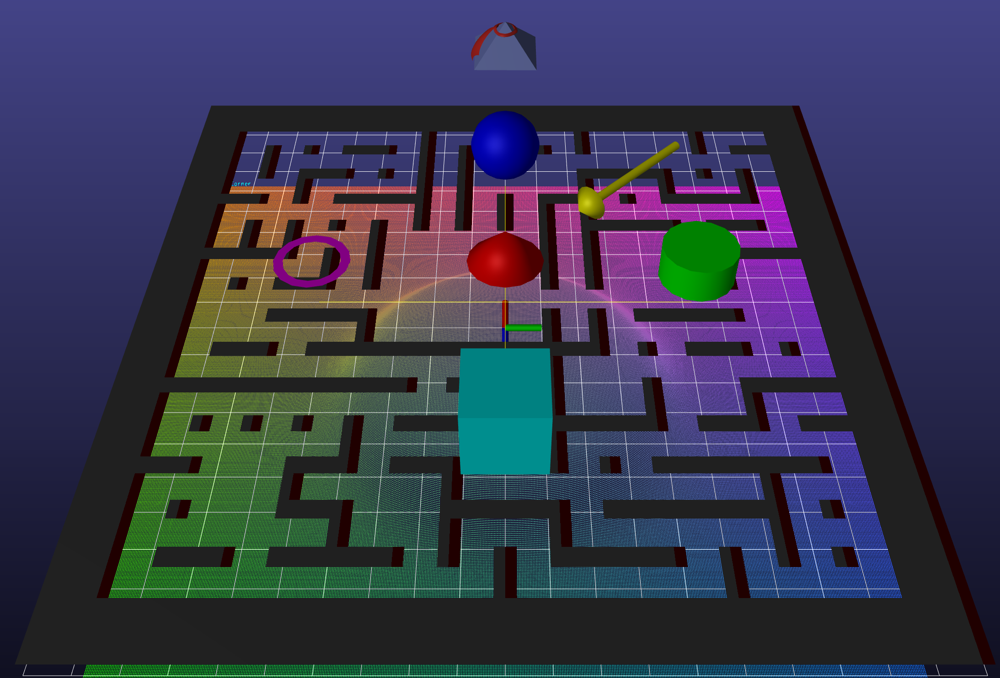

# vephor

## A header-only headless visualization library with an OpenGL backend

<div align="center">
  
</div>

## Summary

Vephor allows for interactive visualizations in situations where visualizations are infeasible, such as on headless systems, or where it is inconvenient to include graphics libraries.  

Vephor creates graphics library agnostic visualization definitions before either saving them to disk for later viewing or sending them to a visualizer elsewhere for immediate viewing.  

When running in server mode, Vephor visualization code is meant to be as dormant as possible, only using resources when a client connects and requests the visualization.

Vephor supports both C++ and Python.

## Dependencies

Vephor requires the following dependencies

| Dependency \[version]                               | Core               | OpenGL             |
|-----------------------------------------------------|--------------------|--------------------|
| [Eigen](https://eigen.tuxfamily.org/) \[≥ 3.3.0]    | :heavy_check_mark: | :heavy_check_mark: |
| [manif](https://artivis.github.io/manif/index.html) | :heavy_check_mark: | :heavy_check_mark: |
| [GLEW](https://glew.sourceforge.net/)               | :x:                | :heavy_check_mark: |
| [GLFW](https://www.glfw.org/)                       | :x:                | :heavy_check_mark: |

See core/README.md and opengl/README.md for more details on separated dependencies.

### vcpkg

All required dependencies can be installed via vcpkg if you opt to build the software with their toolchain.

This requires that you have vcpkg installed on your system. If not yet installed, you may install as follows. See
the [official documentation](https://learn.microsoft.com/en-us/vcpkg/get_started/get-started?pivots=shell-bash) for
additional details and instructions for Windows systems. Install vcpkg in a persistent directory on your system.

```bash
cd <persistent-directory>

# Download and bootstrap vcpkg
git clone https://github.com/microsoft/vcpkg.git
cd vcpkg
./bootstrap-vcpkg.sh

# Set VCPKG_ROOT and prepend it to your path
vcpkg_root=$(pwd)
echo "export VCPKG_ROOT=$vcpkg_root" >> ~/.bashrc
echo "export PATH=\${VCPKG_ROOT}\${PATH:+:\${PATH}}" >> ~/.bashrc
```

### Linux

Refer to the following instructions to manually install dependencies on an Ubuntu system. Feel free to adapt to your
distro and package manager of choice.

#### Eigen

```bash
sudo apt install libeigen3-dev
```

#### manif

Note that manif depends on Eigen. If Eigen is installed in a non-standard location, be sure to provide a
`CMAKE_PREFIX_PATH` when configuring.

```bash
git clone https://github.com/artivis/manif.git
cd manif
cmake -S . -B build
cmake --build build
sudo cmake --install build
```

#### GLEW

```bash
sudo apt install libglew-dev
```

#### GLFW

```bash
sudo apt install libglfw3-dev
```

## C++ Install

Below are supported methods for building and installing the Vephor C++ library.

### vcpkg

Build and install as described in the following sections but with the additional CMake configuration flag
`-DCMAKE_TOOLCHAIN_FILE=$VCPKG_ROOT/scripts/buildsystems/vcpkg.cmake`. Alternately, for Linux systems, build with the
`--preset=vcpkg` flag. See the following example configure steps.

```bash
cmake -S . -B build -DCMAKE_TOOLCHAIN_FILE=$VCPKG_ROOT/scripts/buildsystems/vcpkg.cmake ...
cmake -S . -B build --preset=vcpkg ...  # Linux only
```

### Linux

```bash
cd <vephor-root>

cmake -S . -B build -DCMAKE_BUILD_TYPE=Release
cmake --build build
sudo cmake --install build
```

### Windows

```bash
cd <vephor-root>

cmake -S . -B build -DCMAKE_BUILD_TYPE=Release -DCMAKE_INSTALL_PREFIX=c:/msys64/mingw64
cd build
mingw32-make
sudo mingw32-make install
```

## Python Install

Install the Vephor library Python bindings in the active Python environment as follows.

### Linux

```bash
pip install --upgrade pip
pip install .
```

### Windows

```bash
pip install . --config-settings=cmake.generator="MinGW Makefiles"
```

### Without OpenGL

```bash
pip install . --config-settings=cmake.define.VEPHOR_BUILD_OPENGL=OFF
```

or

```bash
pip install python/no-opengl
```


### Troubleshooting

Refer to the contained sections for common Python installation issues.

#### Conda Environment

Conda employs
their [own set of compiler tools](https://docs.conda.io/projects/conda-build/en/stable/resources/compiler-tools.html#)
over those installed on the system. There is a known compatability bug between these tools and modern versions of the
GCC compiler (see ContinuumIO/anaconda-issues#11152). If you encounter linker errors when installing (e.g. those shown
below), then attempt one of the solutions
described [here](https://github.com/ContinuumIO/anaconda-issues/issues/11152#issuecomment-1453005442).

In particular, this solution is recommended:

```bash
conda install -c conda-forge ld_impl_linux-64  # Modify the suffix to correspond with your platform
```

If, on importing vephor, you have an error complaining about a missing GLIBCXX version, try this:

```bash
conda install -c conda-forge libstdcxx-ng
```

<details>
<summary>Example linker error</summary>

```
/home/username/conda/envs/my_env/compiler_compat/ld: warning: libGLdispatch.so.0, needed by /usr/lib/gcc/x86_64-linux-gnu/11/../../../x86_64-linux-gnu/libGL.so, not found (try using -rpath or -rpath-link)
/home/username/conda/envs/my_env/compiler_compat/ld: warning: libGLX.so.0, needed by /usr/lib/gcc/x86_64-linux-gnu/11/../../../x86_64-linux-gnu/libGL.so, not found (try using -rpath or -rpath-link)
/home/username/conda/envs/my_env/compiler_compat/ld: warning: libxcb.so.1, needed by /usr/lib/gcc/x86_64-linux-gnu/11/../../../x86_64-linux-gnu/libX11.so, not found (try using -rpath or -rpath-link)
/home/username/conda/envs/my_env/compiler_compat/ld: /usr/lib/gcc/x86_64-linux-gnu/11/../../../x86_64-linux-gnu/libX11.so: undefined reference to `xcb_get_maximum_request_length'
/home/username/conda/envs/my_env/compiler_compat/ld: /usr/lib/gcc/x86_64-linux-gnu/11/../../../x86_64-linux-gnu/libGL.so: undefined reference to `__glDispatchRegisterStubCallbacks'
/home/username/conda/envs/my_env/compiler_compat/ld: /usr/lib/gcc/x86_64-linux-gnu/11/../../../x86_64-linux-gnu/libGL.so: undefined reference to `__glXGLLoadGLXFunction'
/home/username/conda/envs/my_env/compiler_compat/ld: /usr/lib/gcc/x86_64-linux-gnu/11/../../../x86_64-linux-gnu/libX11.so: undefined reference to `xcb_poll_for_queued_event'
/home/username/conda/envs/my_env/compiler_compat/ld: /usr/lib/gcc/x86_64-linux-gnu/11/../../../x86_64-linux-gnu/libX11.so: undefined reference to `xcb_wait_for_event'
/home/username/conda/envs/my_env/compiler_compat/ld: /usr/lib/gcc/x86_64-linux-gnu/11/../../../x86_64-linux-gnu/libX11.so: undefined reference to `xcb_get_setup'
/home/username/conda/envs/my_env/compiler_compat/ld: /usr/lib/gcc/x86_64-linux-gnu/11/../../../x86_64-linux-gnu/libX11.so: undefined reference to `xcb_poll_for_event'
/home/username/conda/envs/my_env/compiler_compat/ld: /usr/lib/gcc/x86_64-linux-gnu/11/../../../x86_64-linux-gnu/libX11.so: undefined reference to `xcb_connection_has_error'
/home/username/conda/envs/my_env/compiler_compat/ld: /usr/lib/gcc/x86_64-linux-gnu/11/../../../x86_64-linux-gnu/libGL.so: undefined reference to `__glDispatchFini'
/home/username/conda/envs/my_env/compiler_compat/ld: /usr/lib/gcc/x86_64-linux-gnu/11/../../../x86_64-linux-gnu/libX11.so: undefined reference to `xcb_take_socket'
/home/username/conda/envs/my_env/compiler_compat/ld: /usr/lib/gcc/x86_64-linux-gnu/11/../../../x86_64-linux-gnu/libX11.so: undefined reference to `xcb_disconnect'
/home/username/conda/envs/my_env/compiler_compat/ld: /usr/lib/gcc/x86_64-linux-gnu/11/../../../x86_64-linux-gnu/libX11.so: undefined reference to `xcb_generate_id'
/home/username/conda/envs/my_env/compiler_compat/ld: /usr/lib/gcc/x86_64-linux-gnu/11/../../../x86_64-linux-gnu/libGL.so: undefined reference to `__glDispatchUnregisterStubCallbacks'
/home/username/conda/envs/my_env/compiler_compat/ld: /usr/lib/gcc/x86_64-linux-gnu/11/../../../x86_64-linux-gnu/libGL.so: undefined reference to `__GLXGL_CORE_FUNCTIONS'
/home/username/conda/envs/my_env/compiler_compat/ld: /usr/lib/gcc/x86_64-linux-gnu/11/../../../x86_64-linux-gnu/libGL.so: undefined reference to `_glapi_tls_Current'
/home/username/conda/envs/my_env/compiler_compat/ld: /usr/lib/gcc/x86_64-linux-gnu/11/../../../x86_64-linux-gnu/libX11.so: undefined reference to `xcb_parse_display'
/home/username/conda/envs/my_env/compiler_compat/ld: /usr/lib/gcc/x86_64-linux-gnu/11/../../../x86_64-linux-gnu/libGL.so: undefined reference to `__glDispatchInit'
/home/username/conda/envs/my_env/compiler_compat/ld: /usr/lib/gcc/x86_64-linux-gnu/11/../../../x86_64-linux-gnu/libX11.so: undefined reference to `xcb_wait_for_reply64'
/home/username/conda/envs/my_env/compiler_compat/ld: /usr/lib/gcc/x86_64-linux-gnu/11/../../../x86_64-linux-gnu/libX11.so: undefined reference to `xcb_poll_for_reply64'
/home/username/conda/envs/my_env/compiler_compat/ld: /usr/lib/gcc/x86_64-linux-gnu/11/../../../x86_64-linux-gnu/libX11.so: undefined reference to `xcb_connect'
/home/username/conda/envs/my_env/compiler_compat/ld: /usr/lib/gcc/x86_64-linux-gnu/11/../../../x86_64-linux-gnu/libX11.so: undefined reference to `xcb_writev'
/home/username/conda/envs/my_env/compiler_compat/ld: /usr/lib/gcc/x86_64-linux-gnu/11/../../../x86_64-linux-gnu/libX11.so: undefined reference to `xcb_connect_to_display_with_auth_info'
/home/username/conda/envs/my_env/compiler_compat/ld: /usr/lib/gcc/x86_64-linux-gnu/11/../../../x86_64-linux-gnu/libX11.so: undefined reference to `xcb_get_file_descriptor'
collect2: error: ld returned 1 exit status
```

</details>

## API - TLDR

The `Window` class is the primary way to interact with the library.  Objects that implement certain render functions can be added to the `Window`, yielding a `RenderNode` that can be used to control the object's pose, scale, visibility, and which allows object destruction.

```
w = Window()
s = Sphere()
node = w.add(s)
node.setScale(2.0)
w.render()
```

For 2d plotting, the `Plot` class is the recommended way to interact with the library.  This presents an interface similar to matplotlib, though the underlying `Window` can also be accessed.

```
p = Plot()
p.plot([0,10],[0,10])
p.scatter([0,10],[10,0])
p.show()
```

The list of supported objects and function calls can be found farther down.

## Examples

Note that the following examples alternate between C++ and Python, but all features are available in both.

### Viz by process creation

This is the default mode for viewing Vephor visualizations - your visualization will be written to a temporary location on disk, and a vephor_show process will be created and pointed to that location.  Note that these visualizations are not interactive apart from allowing camera movement - only network based visualizations allow the creator to respond to callbacks.

```
#include "vephor_ext.h"

using namespace vephor;

int main()
{
	Window window;
	
	window.add(make_shared<Axes>(), Vec3(500,-1000,2000));
	window.add(make_shared<Sphere>(), Vec3(495,-1000,2000));
	window.add(make_shared<Cone>(), Vec3(505,-1000,2000));
	window.add(make_shared<Cylinder>(), Vec3(500,-995,2000));
	window.add(make_shared<Cube>(), Vec3(500,-1005,2000));
	
	window.render();

	return 0;
}
```

### Viz by saving to a file

```
#! /usr/bin/env python3

import vephor as v4
import numpy as np

w = v4.Window()

points = []
for i in range(0,100):
    for j in range(0,100):
        points.append((i,j,0))
points = np.array(points)

p = v4.Particle(points)
p.setScreenSpaceMode()
p.setSize(0.001)
w.add(p)
w.save("test_scene")
```

This will create a folder called test_scene.  The visualization can then be viewed by calling:

```
vephor_show test_scene
```

### Viz by server

The following code will open a server on the default Vephor port, 5533.  The port can be set when enabling server mode.

In addition to server use, this example also shows how to allow the client to continue updating the visualization.  The visualization will run separately from any client being connected, and a new client will begin visualizing at the current state of the client.

Note that multiple clients can connect to one server.

```
#include "vephor_ext.h"

using namespace vephor;

int main()
{
	Window window;
	
	window.setServerMode();
	
	double obj_mesh_dist = 5.0f;
	
	
	// Make a "clock"
	for (int i = 1; i <= 12; i++)
	{
		float angle = i / 12.0 * 2 * M_PI;
		
		Vec3 dir = Vec3(cos(angle), sin(angle), 0);
		auto text = make_shared<Text>(std::to_string(i));
		text->setAnchorCentered();
		window.add(text, dir * obj_mesh_dist * 1.5);
		
		vector<Vec3> verts = {
			Vec3(0,0,0),
			dir * obj_mesh_dist * 1.5
		};
		window.add(make_shared<Lines>(verts), Vec3::Zero());
	}
	
	// Use a mesh for the clock hand
	string base_asset_dir = getBaseAssetDir();
	auto obj_mesh = make_shared<ObjMesh>(base_asset_dir+"/assets/pyramid.obj");
	auto obj_mesh_node = window.add(obj_mesh, Transform3(Vec3(obj_mesh_dist,0,0)));
	
	float angle = 0;
	while (true)
	{
		angle += 0.01;
		obj_mesh_node->setPos(Vec3(cos(angle), sin(angle), 0) * obj_mesh_dist);
		obj_mesh_node->setOrient(Vec3(0,0,angle+M_PI));
		
		window.render(false /*wait*/);
		
		std::this_thread::sleep_for(std::chrono::milliseconds((int)(33)));
	}

	return 0;
}
```

Once this server is running, connect to it using:

```
vephor_show -m client
```

### Web viewer

Vephor includes a browser-based viewer and gateway in `web_client`. The gateway serves the web application, converts
between WebSockets and the Vephor TCP protocol, and caches the latest visualization state so that browsers opened
later can immediately display the current scene.

Install the Python WebSocket dependency and start the gateway from the Vephor source directory:

```bash
python3 -m pip install websockets
python3 web_client/gateway.py
```

Then open `http://localhost:8080`. By default, the viewer lets the user enter the address of a Vephor visualization
server, such as `localhost:5533`, in the Peer Connections panel.

The gateway uses the following ports by default:

| Port | Purpose |
|------|---------|
| 8080 | Web viewer HTTP server |
| 5634 | Browser-to-gateway WebSocket server |
| 5633 | Listener for inbound Vephor connections |

The gateway listeners can be changed with `--http-port`, `--ws-port`, and `--tcp-port`, respectively. The bundled
browser client expects the WebSocket listener on port 5634, so changing that port also requires adjusting the client
or an equivalent proxy configuration. Run `python3 web_client/gateway.py --help` for the complete command-line
reference.

#### Bridge mode

Bridge mode is intended for deployments where a visualization producer and the web viewer are packaged together, or
where users should be able to open a URL without selecting a Vephor server themselves. In this mode, the gateway
maintains an outbound connection to one fixed visualization producer:

```bash
python3 web_client/gateway.py --bridge-target visualization-host:5533
```

The connection is established even when no browser is open. If the producer is unavailable or disconnects, the
gateway retries indefinitely. The default retry delay is three seconds and can be changed as follows:

```bash
python3 web_client/gateway.py \
    --bridge-target visualization-host:5533 \
    --bridge-retry-seconds 5
```

If the port is omitted from `--bridge-target`, it defaults to 5533. Hostnames, IPv4 addresses, and bracketed IPv6
addresses such as `[::1]:5533` are accepted.

For a systemd deployment, add the bridge arguments to the service's `ExecStart` command:

```ini
ExecStart=/usr/bin/python3 /path/to/vephor/web_client/gateway.py --bridge-target visualization-host:5533
```

After changing a service unit, reload it and restart the gateway:

```bash
sudo systemctl daemon-reload
sudo systemctl restart vephor-gateway.service
```

In a container deployment, use the same command-line option and use the visualization producer's container or
Compose service name as the host, for example `--bridge-target visualization:5533`. Publish the HTTP and WebSocket
ports needed by browser clients (8080 and 5634 by default).

### Viz by server (bring your own client)

"Bring your own client" mode allows you to create interactive visualizations without needing to separately call vephor_show.  It will create a server and also create a client process to talk to that server.

Call the static mode setter before constructing windows or plots. The producer continues to run in server mode, while
Vephor starts a local viewer and connects it to the server:

```python
import time
import vephor as v4

v4.Window.setServerModeBYOC()

window = v4.Window("Counter")
cube_node = window.add(v4.Cube())

while True:
    cube_node.setOrient((0, 0, time.monotonic()))
    window.render(False, False)
    time.sleep(1 / 30)
```

Pass `record_also=True` and a recording path to `setServerModeBYOC` to serve and record the visualization at the same
time. `setClientModeBYOS` provides the inverse arrangement: it starts a local server process and makes the application
act as its client.

### Transform tree

Every object added to a `Window` receives a `RenderNode`. Nodes hold pose, scale, visibility, layer, and parent
information independently of the renderable object. Parenting lets a group of objects move as one transform tree:

```python
import numpy as np
import vephor as v4

window = v4.Window()
parent = window.add((0, 0, 0))

for angle in np.linspace(0, 2 * np.pi, 8, endpoint=False):
    child = window.add(v4.Sphere(0.2), (3 * np.cos(angle), 3 * np.sin(angle), 0))
    child.setParent(parent)

parent.setOrient((0, 0, np.pi / 4))
window.render()
```

Child transforms are relative to their parent. A node can also be parented to one of the window anchor nodes, such as
`getWindowTopLeftNode()`, for overlay content tied to a screen edge or corner.

### 2d plotting

`Plot` provides a matplotlib-like interface for lines, scatter points, annotations, shapes, images, legends, and axis
configuration:

```python
import numpy as np
import vephor as v4

x = np.linspace(0, 2 * np.pi, 200)

plot = v4.Plot("Trigonometry")
plot.darkMode()
plot.xlabel("x")
plot.ylabel("value")
plot.plot(x, np.sin(x), label="sin(x)")
plot.scatter(x[::20], np.cos(x[::20]), marker="diamond", label="cos(x)")
plot.text("origin", 0.2, (0, 0), (1, 1, 0), anchor="bottom_left")
plot.setLegendTopRight()
plot.show()
```

Use `Plot3D` for three-dimensional line plots. The underlying `Window` is available through `plot.window()` when
lower-level objects or callbacks are needed.

### Image plotting

```
#! /usr/bin/env python3

import os

import vephor as v4
import numpy as np

image = np.zeros((16,16,3))
image[:8,8:] = np.array((0.5,0.5,0.5))
image[8:,:8] = np.array((0.75,0.75,0.75))
image[8:,8:] = np.array((1,1,1))

plt = v4.Plot()
plt.imshow(image)
plt.show()
```

### Image plotting - OpenCV images in C++

Vephor does not require OpenCV. Copy a contiguous `cv::Mat` into a Vephor `Image<uint8_t>`, then pass that image to
`Plot::imshow`:

```cpp
#include <cstring>
#include <opencv2/opencv.hpp>
#include "vephor_ext.h"

using namespace vephor;

int main()
{
    cv::Mat frame = cv::imread("image.png", cv::IMREAD_COLOR);
    if (frame.empty()) return 1;
    if (!frame.isContinuous()) frame = frame.clone();

    // OpenCV color images are BGR; convert to RGB before copying.
    cv::cvtColor(frame, frame, cv::COLOR_BGR2RGB);

    Image<uint8_t> image(frame.cols, frame.rows, frame.channels());
    image.copyFromBuffer(reinterpret_cast<const char*>(frame.data),
                         static_cast<int>(frame.total() * frame.elemSize()));

    Plot plot("OpenCV image");
    plot.imshow(image);
    plot.show();
}
```

## API - Exhaustive

The grid below covers the public headless/core API and its Python bindings. Overloads are combined where they perform
the same operation; a few names differ slightly between C++ and Python. The separate `vephor::ogl` backend exposes
lower-level renderer-specific facilities and is documented by its headers.

<table>
	<tr><th>Class</th><th>Function</th><th>Description</th><th>Arguments</th></tr>
	<tr><th>Window</th><td>Window</td><td>Create a window.  Width/height of (-1,-1) means the window should fill the screen.</td><td>(width=-1, height=-1, title="show")</td></tr>
	<tr><td></td><td>add</td><td>Add an object to the window for rendering.</td><td>(obj, transform=identity, overlay=false, layer=0)</td></tr>
	<tr><td></td><td>canRender</td><td>Check if rendering is possible, for example when a client is connected in server mode.</td></tr>
	<tr><td></td><td>render</td><td>Render current window contents.</td><td>(wait_close=true, wait_key=false)</td></tr>
	<tr><td></td><td>renderInWaiting</td><td>Render all windows currently waiting for a viewer.</td></tr>
	<tr><td></td><td>save</td><td>Save current window contents to a file.</td><td>(path)</td></tr>
	<tr><td></td><td>clear</td><td>Remove all current window contents.</td></tr>
	<tr><td></td><td>getNumObjects</td><td>Get the number of objects, including destroyed entries.</td></tr>
	<tr><td></td><td>getNumActiveObjects</td><td>Get the number of objects that have not been destroyed.</td></tr>
	<tr><td></td><td>setTitle</td><td>Set window title.</td><td>(title)</td></tr>
	<tr><td></td><td>layoutAbsolute</td><td>Set the window layout in pixels.</td><td>(width, height, x_position=-1, y_position=-1)</td></tr>
	<tr><td></td><td>layoutPerUnit</td><td>Set the window layout in per-unit screen coordinates.</td><td>(width, height, x_position=-1, y_position=-1)</td></tr>
	<tr><td></td><td>setStaticCameraMode</td><td>Use a fixed camera.</td><td>(to=(0,0,0), from=(-1,0,-1), up=(0,0,-1))</td></tr>
	<tr><td></td><td>setSpinCameraMode</td><td>Use a camera that revolves around a target.</td><td>(to, up, from_dist, from_angle_deg, s_per_rev)</td></tr>
	<tr><td></td><td>setTrackballMode</td><td>Set up the standard 3d camera mode.</td><td>(to=(0,0,0), from=(-1,0,-1), up=(0,0,-1), use_3d=false)</td></tr>
	<tr><td></td><td>setTrackballModeVision</td><td>Configure trackball controls using vision-coordinate conventions.</td></tr>
	<tr><td></td><td>setPlotMode</td><td>Set up the 2d plotting camera mode.</td><td>equal=false</td></tr>
	<tr><td></td><td>setTrajectoryCameraMode</td><td>Move the camera through timestamped trajectory nodes.</td><td>(trajectory, motion_mode=SINGLE, speed=1, start_time=0, polynomial_degree=3)</td></tr>
	<tr><td></td><td>setSolidBackground</td><td>Set one background color.</td><td>(color)</td></tr>
	<tr><td></td><td>setGradientBackground</td><td>Set top and bottom background colors.</td><td>(top, bottom)</td></tr>
	<tr><td></td><td>setCheckerBackground</td><td>Set a checkerboard background.</td><td>(color_1, color_2, n_cells=(8,8))</td></tr>
	<tr><td></td><td>setOpacity</td><td>Set window opacity.</td><td>(opacity)</td></tr>
	<tr><td></td><td>setFrameLock / setFrameSkipMessageLimit</td><td>Control frame rate and skipped-frame reporting.</td><td>(value)</td></tr>
	<tr><td></td><td>setServerMode</td><td>Put the window in server mode.</td><td>(wait=false, port=5533, record_also=false, record_path="", metadata=default)</td></tr>
	<tr><td></td><td>setServerModeBYOC</td><td>Put the window in server mode, and spawns a client to connect.</td><td>(record_also=false,record_path="")</td></tr>
	<tr><td></td><td>setClientMode</td><td>Connect all windows to a Vephor server.</td><td>(wait=false, host="localhost", port=5533, record_also=false, record_path="")</td></tr>
	<tr><td></td><td>setClientModeBYOS</td><td>Spawn a server and make the application its client.</td><td>(record_also=false, record_path="")</td></tr>
	<tr><td></td><td>setRecordMode</td><td>Put the window in record mode.</td><td>(path="")</td></tr>
	<tr><td></td><td>checkAndConsumeFlag</td><td>Check a server metadata flag, and consume it if it is a one-shot flag.</td><td>(flag)</td></tr>
	<tr><td></td><td>setKeyPressCallback</td><td>Set key press callback function.</td><td>(callback)</td></tr>
	<tr><td></td><td>setKeyReleaseCallback</td><td>Set key release callback function.</td><td>(callback)</td></tr>
	<tr><td></td><td>setMouseClickCallback</td><td>Set mouse click callback function.</td><td>(callback)</td></tr>
	<tr><td></td><td>set*WithMessageCallback</td><td>Install key or mouse callbacks that also receive the source message.</td><td>(callback)</td></tr>
	<tr><td></td><td>setPrintFlagNetworkUse</td><td>Enable network-use diagnostics for control flags.</td><td>(enabled=true)</td></tr>
	<tr><td></td><td>setGlobalDefaultOpacity</td><td>Set the default opacity for subsequently created windows.</td><td>(opacity)</td></tr>
	<tr><td></td><td>getWindow*Node</td><td>Get one of nine screen-relative overlay anchor nodes.</td><td>()</td></tr>
	<tr><th>RenderNode</th><td></td><td>Control an object's transform and render state.</td><td></td></tr>
	<tr><td></td><td>getPos</td><td>Get position of node in parent frame.</td></tr>
	<tr><td></td><td>setPos</td><td>Set position of node in parent frame.</td><td>(pos_in_world)</td></tr>
	<tr><td></td><td>getOrient</td><td>Get rotation that rotates node frame to parent frame.</td></tr>
	<tr><td></td><td>setOrient</td><td>Set rotation that rotates node frame to parent frame.</td><td>(parent_from_node_rotation)</td></tr>
	<tr><td></td><td>getTransform</td><td>Get transform that transforms node frame to parent frame.</td></tr>
	<tr><td></td><td>setTransform</td><td>Set transform that transforms node frame to parent frame.</td><td>(parent_from_node)</td></tr>
	<tr><td></td><td>getScale</td><td>Get scale of the node.</td></tr>
	<tr><td></td><td>setScale</td><td>Set scale of the node.</td><td>(scale)</td></tr>
	<tr><td></td><td>setParent</td><td>Set the transform parent of this node.  Replaces world frame as parent.</td><td>(parent)</td></tr>
	<tr><td></td><td>getShow</td><td>Get whether node should be shown.</td></tr>
	<tr><td></td><td>setShow</td><td>Set whether node should be shown.</td><td>(show)</td></tr>
	<tr><td></td><td>getDestroy</td><td>Get whether node has been destroyed.</td></tr>
	<tr><td></td><td>setDestroy</td><td>Set node to be destroyed.</td></tr>
	<tr><td></td><td>enableOverlay</td><td>Render the node in the overlay pass.</td></tr>
	<tr><td></td><td>setLayer</td><td>Set render ordering layer.</td><td>(layer)</td></tr>
	<tr><td></td><td>disableBounds</td><td>Exclude the object from automatic camera bounds.</td></tr>
	<tr><td></td><td>setSelectable</td><td>Mark the object as selectable.</td><td>()</td></tr>
	<tr><th>Plot</th><td>Plot</td><td>Create a plot.</td><td>(title)</td></tr>
	<tr><td></td><td>plot</td><td>Plot a continuous line.</td><td>(x_list, y_list, options)</td></tr>
	<tr><td></td><td>plot_d</td><td>Plot double-precision input by converting it to the plot representation.</td><td>(x, y, options)</td></tr>
	<tr><td></td><td>scatter</td><td>Plot a set of points.</td><td>(x_list, y_list, options)</td></tr>
	<tr><td></td><td>scatter_colormap / scatter_cs</td><td>Plot points colored from scalar values or explicit colors and sizes.</td><td>(x, y, values, options)</td></tr>
	<tr><td></td><td>scatter_d</td><td>Scatter double-precision input by converting it to the plot representation.</td><td>(x, y, options)</td></tr>
	<tr><td></td><td>show</td><td>Render current plot contents.</td><td>(wait_close=true, wait_key=false)</td></tr>
	<tr><td></td><td>save</td><td>Save current window contents to a file.</td><td>(path)</td></tr>
	<tr><td></td><td>clear</td><td>Remove all current plot contents.</td></tr>
	<tr><td></td><td>title</td><td>Set plot title.</td><td>(title)</td></tr>
	<tr><td></td><td>window</td><td>Access the underlying Window.</td></tr>
	<tr><td></td><td>backColor / foreColor / gridColor</td><td>Set plot palette colors.</td><td>(color)</td></tr>
	<tr><td></td><td>darkMode</td><td>Apply the dark plot palette.</td></tr>
	<tr><td></td><td>colorCycle</td><td>Get the plot color for an index.</td><td>(index)</td></tr>
	<tr><td></td><td>xlabel</td><td>Set x axis label.</td><td>(label)</td></tr>
	<tr><td></td><td>ylabel</td><td>Set y axis label.</td><td>(label)</td></tr>
	<tr><td></td><td>xflip / yflip / xyswap</td><td>Flip or swap plot axes.</td><td>(enabled=true)</td></tr>
	<tr><td></td><td>equal</td><td>Set plot axes to have equal scales.</td><td>(is_equal)</td></tr>
	<tr><td></td><td>textScale</td><td>Set plot label and tick text scale.</td><td>(scale)</td></tr>
	<tr><td></td><td>limits</td><td>Set plot limits.</td><td>(min_x, max_x, min_y, max_y)</td></tr>
	<tr><td></td><td>label</td><td>Add an entry to the plot legend.</td><td>(text, color, marker="circle")</td></tr>
	<tr><td></td><td>cursorCallout</td><td>Enable or disable cursor coordinate callouts.</td><td>(enabled)</td></tr>
	<tr><td></td><td>setLegend*</td><td>Place the legend at one of the four corners.</td></tr>
	<tr><td></td><td>text</td><td>Add anchored text to the plot.</td><td>(text, size, offset, color, anchor="center")</td></tr>
	<tr><td></td><td>polygon</td><td>Add a polygon to the plot. 0 thickness for a thin line border, -1 for filled.</td><td>(verts, color, thickness=0)</td></tr>
	<tr><td></td><td>polygon_d / circle_d / line_d</td><td>Double-precision variants of the corresponding shape helpers.</td><td>(geometry, color, thickness)</td></tr>
	<tr><td></td><td>circle</td><td>Add a circle to the plot. 0 thickness for a thin line border, -1 for filled.</td><td>(center, rad, color, thickness=0, slices=16)</td></tr>
	<tr><td></td><td>arrow / arrowhead</td><td>Add an arrow or arrowhead.</td><td>(points, color, radius=1)</td></tr>
	<tr><td></td><td>rect</td><td>Add a rectangle to the plot. 0 thickness is a thin border and -1 is filled.</td><td>(center, size, color, thickness=0)</td></tr>
	<tr><td></td><td>rect_min_max</td><td>Add a rectangle specified by opposite corners.</td><td>(min, max, color, thickness=0)</td></tr>
	<tr><td></td><td>line</td><td>Add a line to the plot.</td><td>(vert_list, color, thickness)</td></tr>
	<tr><td></td><td>imshow</td><td>Add an image to the plot.</td><td>(image, nearest=false, offset=(0,0), scale=1, no_flip=false)</td></tr>
	<tr><td></td><td>setKeyPressCallback / setKeyReleaseCallback / setMouseClickCallback</td><td>Install plot interaction callbacks.</td><td>(callback)</td></tr>
	<tr><th>Plot3D</th><td>Plot3D</td><td>Create a 3D line plot.</td><td>(title="plot", width=800, height=800)</td></tr>
	<tr><td></td><td>plot</td><td>Plot a 3D line, optionally with color, style, thickness, and label.</td><td>(x, y, z, options)</td></tr>
	<tr><td></td><td>title / xlabel / ylabel / zlabel</td><td>Set the title or an axis label.</td><td>(text)</td></tr>
	<tr><td></td><td>backColor / foreColor / gridColor</td><td>Set plot palette colors.</td><td>(color)</td></tr>
	<tr><td></td><td>colorCycle</td><td>Get the plot color for an index.</td><td>(index)</td></tr>
	<tr><td></td><td>window / show / save / clear</td><td>Access, display, save, or clear the plot.</td></tr>
	<tr><th>Arrow</th><td>Arrow</td><td>Create an arrow.</td><td>(start, end, rad=1.0, slices=16)</td></tr>
	<tr><td></td><td>setColor</td><td>Set color.</td><td>(color)</td></tr>
	<tr><th>Axes</th><td>Axes</td><td>Create a set of axes.</td><td>(size=1.0)</td></tr>
	<tr><td></td><td>setColors / setColorsCMY</td><td>Set custom axis colors or use cyan, magenta, and yellow.</td><td>(x, y, z)</td></tr>
	<tr><th>Circle</th><td>Circle</td><td>Create a circular disc with a z axis normal.  Outer rim of the disc is set by rad, inner rim is thickness units inwards.</td><td>(rad=1.0, thickness=1.0, slices=16)</td></tr>
	<tr><td></td><td>setColor</td><td>Set color.</td><td>(color)</td></tr>
	<tr><th>Cone</th><td>Cone</td><td>Create a cone with the flat surface in the z=0 plane, with the top height units along the z axis.</td><td>(rad=1.0, height=1.0, slices=16)</td></tr>
	<tr><td></td><td>setColor</td><td>Set color.</td><td>(color)</td></tr>
	<tr><th>Cube</th><td>Cube</td><td>Create a cube.</td><td>(rad)</td></tr>
	<tr><td></td><td>setColor</td><td>Set color.</td><td>(color)</td></tr>
	<tr><th>Cylinder</th><td>Cylinder</td><td>Create a cylinder along the z axis, with half of height on either side.</td><td>(rad=1.0, height=1.0, slices=16)</td></tr>
	<tr><td></td><td>setColor</td><td>Set color.</td><td>(color)</td></tr>
	<tr><th>Grid</th><td>Grid</td><td>Create a grid.</td><td>(rad, normal=(0,0,1), right=(1,0,0), cell_size=1.0)</td></tr>
	<tr><td></td><td>setColor</td><td>Set color.</td><td>(color)</td></tr>
	<tr><th>Lines</th><td>Lines</td><td>Create a line.</td><td>(vert_list, color_list)</td></tr>
	<tr><td></td><td>setColor</td><td>Set color.</td><td>(color)</td></tr>
	<tr><td></td><td>setLineStrip</td><td>Set if verts form a continuous line - if false, each pair is a separate line.  Initial state is a continuous line.</td><td>(is_strip)</td></tr>
	<tr><td></td><td>setAlpha</td><td>Enable or disable alpha blending.</td><td>(enabled)</td></tr>
	<tr><th>Mesh</th><td>Mesh</td><td>Create a mesh.</td><td>(mesh_data)</td></tr>
	<tr><td></td><td>setTexture</td><td>Set texture for this mesh.</td><td>(image, nearest_filtering=false)</td></tr>
	<tr><td></td><td>setColor</td><td>Set color.</td><td>(color)</td></tr>
	<tr><td></td><td>setSpecular</td><td>Set whether specular highlights should be used.</td><td>(specular)</td></tr>
	<tr><td></td><td>setCull</td><td>Set whether faces should be culled if facing away from the camera.</td><td>(cull)</td></tr>
	<tr><td></td><td>setDiffuseStrength / setAmbientStrength / setEmissiveStrength</td><td>Set material lighting strengths.</td><td>(strength)</td></tr>
	<tr><th>ObjMesh</th><td>ObjMesh</td><td>Create geometry using a .obj mesh file.</td><td>(path)</td></tr>
	<tr><td></td><td>setColor</td><td>Set color.</td><td>(color)</td></tr>
	<tr><th>Particle</th><td>Particle</td><td>Create a point cloud.</td><td>(vert_list, color_list)</td></tr>
	<tr><td></td><td>setSize</td><td>Set size of each particle.</td><td>(size)</td></tr>
	<tr><td></td><td>setSizes</td><td>Set per-particle sizes.</td><td>(sizes)</td></tr>
	<tr><td></td><td>setColor</td><td>Set color.</td><td>(color)</td></tr>
	<tr><td></td><td>setTexture</td><td>Set texture for each particle.</td><td>(image, nearest_filtering=false)</td></tr>
	<tr><td></td><td>setScreenSpaceMode</td><td>Set whether particle size is in metric space or screen space. If in screen space, size is taken as a screen space portion from 0 to 1.</td><td>(is_screen_space)</td></tr>
	<tr><td></td><td>setDepthTest</td><td>Enable or disable depth testing.</td><td>(enabled)</td></tr>
	<tr><th>Plane</th><td>Plane</td><td>Create a rectangular plane segment.</td><td>(rads)</td></tr>
	<tr><td></td><td>setColor</td><td>Set color.</td><td>(color)</td></tr>
	<tr><td></td><td>setTexture</td><td>Set texture for each particle.</td><td>(image, nearest_filtering=false)</td></tr>
	<tr><th>Sphere</th><td>Sphere</td><td>Create a sphere.</td><td>(rad=1.0, slices=16, stacks=16)</td></tr>
	<tr><td></td><td>setColor</td><td>Set color.</td><td>(color)</td></tr>
	<tr><th>Sprite</th><td>Sprite</td><td>Create a screen-facing rectangle bearing an image.</td><td>(image, nearest_filtering=false)</td></tr>
	<tr><td></td><td>setColor</td><td>Set color.</td><td>(color)</td></tr>
	<tr><td></td><td>setFlip / setXYSwap</td><td>Flip or swap image axes.</td><td>(enabled)</td></tr>
	<tr><td></td><td>setNormalSpriteSheet</td><td>Set normal texture for the sprite.</td><td>(image, nearest_filtering=false)</td></tr>
	<tr><th>Text</th><td>Text</td><td>Create text.  Initial zero point is at the bottom left.</td><td>(text)</td></tr>
	<tr><td></td><td>setColor</td><td>Set color.</td><td>(color)</td></tr>
	<tr><td></td><td>setAnchorBottomLeft</td><td>Set zero point of text to the bottom left.</td></tr>
	<tr><td></td><td>setAnchorLeft</td><td>Set zero point of text to the left.</td></tr>
	<tr><td></td><td>setAnchorTopLeft</td><td>Set zero point of text to the top left.</td></tr>
	<tr><td></td><td>setAnchorBottom</td><td>Set zero point of text to the bottom middle.</td></tr>
	<tr><td></td><td>setAnchorCentered</td><td>Set zero point of text to the middle.</td></tr>
	<tr><td></td><td>setAnchorTop</td><td>Set zero point of text to the top middle.</td></tr>
	<tr><td></td><td>setAnchorBottomRight</td><td>Set zero point of text to the bottom right.</td></tr>
	<tr><td></td><td>setAnchorRight</td><td>Set zero point of text to the right.</td></tr>
	<tr><td></td><td>setAnchorTopRight</td><td>Set zero point of text to the top right.</td></tr>
	<tr><td></td><td>setBillboard</td><td>Control whether text always faces the camera.</td><td>(billboard)</td></tr>
	<tr><td></td><td>setXFlip / setYFlip / setXYSwap</td><td>Flip or swap text axes.</td><td>(enabled)</td></tr>
	<tr><th>ThickLines</th><td>ThickLines</td><td>Create a set of lines with consistent screen space thickness.</td><td>(vert_list, color_list)</td></tr>
	<tr><td></td><td>setColor</td><td>Set color.</td><td>(color)</td></tr>
	<tr><td></td><td>setLineWidth</td><td>Set line width in screen space portion.</td><td>(line_width)</td></tr>
	<tr><th>AmbientLight</th><td>AmbientLight</td><td>Create an ambient light.</td><td>(strength)</td></tr>
	<tr><th>DirLight</th><td>DirLight</td><td>Create a directional light.</td><td>(direction, strength)</td></tr>
	<tr><th>Color</th><td>Color</td><td>Create an RGB or RGBA color.</td><td>(r, g, b, a=1)</td></tr>
	<tr><td></td><td>fromHSL / random</td><td>Create a color from HSL values or choose a random color.</td><td>(h, s, l, a=1)</td></tr>
	<tr><td></td><td>getRGB / getRGBA / getHSL / getAlpha</td><td>Read the color in the requested representation.</td></tr>
	<tr><th>ShowMetadata</th><td>setFlag</td><td>Add a toggle or one-shot control exposed by connected viewers.</td><td>(name, toggle)</td></tr>
	<tr><th>Transform3 / Orient3</th><td>inverse / matrix / translation / rotation / orient / rvec / qvec</td><td>Create, inspect, compose, and invert rigid transforms and orientations.</td></tr>
	<tr><td></td><td>setTranslation / setRotation / normalize / interp</td><td>Modify, normalize, or interpolate transforms.</td><td>(value)</td></tr>
	<tr><th>TransformSim3</th><td>TransformSim3</td><td>Create a rigid transform with uniform scale.</td><td>(translation, rotation=(0,0,0), scale=1)</td></tr>
	<tr><th>MeshData</th><td>MeshData</td><td>Create triangle mesh data from vertices, normals, and texture coordinates.</td><td>(verts, normals, uvs)</td></tr>
	<tr><td></td><td>formLine</td><td>Make mesh data for a 3d line with some thickness.</td><td>(vert_list, rad)</td></tr>
	<tr><td></td><td>formLineLoop</td><td>Make mesh data for a 3d line with some thickness.  Same as formLine, but makes the line into a loop by repeating the first vertex.</td><td>(vert_list, rad)</td></tr>
	<tr><td></td><td>formPolygon</td><td>Make mesh data for an XY plane polygon.</td><td>(vert_list)</td></tr>
	<tr><td></td><td>formPolygonPrism</td><td>Extrude a polygon into a prism.</td><td>(vert_list, height, invert=false, cap=false)</td></tr>
	<tr><td></td><td>formRectange</td><td>Make rectangular mesh data. The exported name intentionally retains this spelling.</td><td>(size)</td></tr>
	<tr><td></td><td>formCube</td><td>Make mesh data for a cube.</td></tr>
	<tr><td></td><td>formSphere</td><td>Make mesh data for a sphere.</td><td>(slices, stacks)</td></tr>
	<tr><td></td><td>formCone</td><td>Make mesh data for a cone.</td><td>(rad, height, slices, smooth=true)</td></tr>
	<tr><td></td><td>formCylinder</td><td>Make mesh data for a cylinder.</td><td>(rad, height, slices, smooth=true)</td></tr>
	<tr><td></td><td>formPlane</td><td>Make mesh data for an XY plane segment.</td><td>(rads)</td></tr>
	<tr><td></td><td>formCircle</td><td>Make mesh data for an XY plane circle.</td><td>(rad, thickness, slices)</td></tr>
	<tr><td></td><td>formHeightMap</td><td>Make mesh data for a height map.</td><td>(height, res, uv_callback=none)</td></tr>
	<tr><td></td><td>formWireframeBox</td><td>Make line mesh data for a wireframe box.</td><td>(bounds)</td></tr>
	<tr><td></td><td>calcSurfaces / createSolidFromTris</td><td>Build surface and solid representations from triangle data.</td><td>(triangles)</td></tr>
	<tr><th>Image</th><td>Image</td><td>Create an image with width, height, and channel count.</td><td>(width, height, channels)</td></tr>
	<tr><td></td><td>getSize / getChannels / getData / getBuffer</td><td>Inspect image dimensions or storage.</td></tr>
	<tr><td></td><td>changeChannels / cast</td><td>Create an image with another channel count or element type.</td><td>(target)</td></tr>
	<tr><td></td><td>copyFromBuffer / setData / flipYInPlace / saveRaw</td><td>Replace, transform, or save pixel storage.</td><td>(data)</td></tr>
	<tr><th>Image functions</th><td>generateSimpleImage</td><td>Create a solid-color image.</td><td>(size, color)</td></tr>
	<tr><td></td><td>generateGradientImage</td><td>Create a vertical color gradient.</td><td>(size, top_color, bottom_color)</td></tr>
	<tr><td></td><td>generateCheckerboardImage</td><td>Create a checkerboard image.</td><td>(size, n_cells, color_1, color_2)</td></tr>
	<tr><td></td><td>generateFlatNormalImage</td><td>Create a flat normal-map image.</td><td>(size)</td></tr>
	<tr><td></td><td>loadImage / saveImage</td><td>Load or save an image file.</td><td>(path, image)</td></tr>
	<tr><th>Utilities</th><td>setTextureCompression</td><td>Configure texture compression and quality.</td><td>(compress, quality=default)</td></tr>
	<tr><td></td><td>convertStringToColor</td><td>Parse a color string.</td><td>(text)</td></tr>
	<tr><td></td><td>getBaseAssetDir</td><td>Return Vephor's installed asset directory.</td></tr>
	<tr><td></td><td>makePerspectiveProj / makeOrthoProj</td><td>Create projection matrices.</td><td>(projection parameters)</td></tr>
	<tr><td></td><td>makeLookAtTransform</td><td>Create a look-at transform.</td><td>(look_at, look_from, up_hint)</td></tr>
	<tr><td></td><td>clamp</td><td>Clamp a value to a range.</td><td>(value, min, max)</td></tr>
</table>
